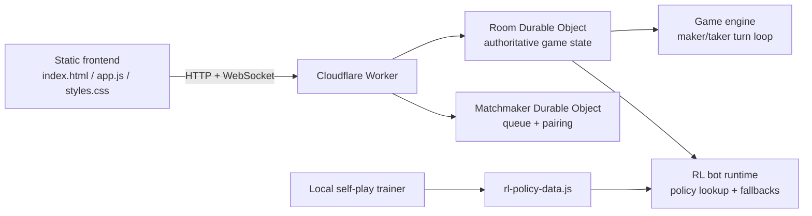

# market-making-sim

A multiplayer hidden-value market-making game with authoritative server state, private room codes, random matchmaking, reconnect handling, and a server-side RL bot.

Frontend runs as a static site. Live game state runs on Cloudflare Workers + Durable Objects. Local RL training exports the policy the live bot uses.

Live demo: [GitHub Pages](https://aditya1909-bit.github.io/market-making-sim/)  
Live backend: [Cloudflare Worker](https://market-making-sim-backend.adityasdutta.workers.dev)

## Why This Is Interesting

- It is not a toy frontend. Room state, hidden settlement value, matchmaking, and rematch flow are all authoritative on the backend.
- It uses Durable Objects in the right place: one room object per live match, plus a dedicated matchmaking object.
- The solo mode is not scripted in the browser. It uses a server-side RL policy exported from local self-play training.
- Card Market now has a separate seat-level bot path with local Python training and Worker-side JS inference.
- The game format matches market-making interview dynamics more closely than a normal order-book sim: one maker, one taker, one hidden value, repeated quote/response rounds.

## Architecture



## Engineering Highlights

- Authoritative multiplayer state with one Durable Object per room
- Private room codes and random matchmaking
- Browser refresh reconnect using stored room code + player id
- Rematch flow with automatic role swap
- Hidden-value settlement model so neither client can inspect the answer early
- Shared `10,000`-scenario pool across live play and RL training
- Hierarchical taker policy with `take`, `pass`, and `probe` modes
- Local parallel self-play trainer with progress, ETA, and policy export

## Gameplay Model

Each match is a hidden scalar contract.

- One player is the `market_maker`
- One player is the `market_taker`
- Maker submits `bid / ask / size`
- Taker responds with `buy / sell / pass`
- After a fixed number of turns, both sides settle against the hidden true value

This structure is closer to interview-style market games than to a continuous limit order book.

## Latest RL Snapshot

Latest local holdout benchmark from the current policy:

- fallback maker vs fallback taker: maker `177.261`, taker `-177.261`
- RL maker vs fallback taker: maker `414.849`
- fallback maker vs RL taker: taker `-93.692`
- maker uplift vs fallback baseline: `+237.588`
- taker uplift vs fallback baseline: `+83.570`

Interpretation:

- the learned maker is materially better than the fallback maker
- the learned taker is also better than the fallback taker
- the environment is still somewhat maker-favored, which is the next area to improve

## Repo Layout

```text
index.html             # Static client shell
styles.css             # Frontend styling
app.js                 # Frontend state, room flow, WebSocket client
asset-data.js          # Older browser-only prototype data

workers/
  src/
    index.js           # Worker entrypoint and routing
    room-do.js         # One Durable Object per room
    matchmaker-do.js   # Matchmaking queue Durable Object
    game-engine.js     # Authoritative turn logic
    bot-policy.js      # Live RL bot runtime
    rl-core.js         # Shared RL state/action helpers
    rl-policy-data.js  # Exported policy used in production
    contracts.js       # Hidden-value contract generator
    protocol.js        # Shared protocol enums and message names
  wrangler.jsonc
  package.json

rl/
  train-self-play.js   # Parallel self-play trainer
  train-shard.js       # Worker-thread shard runner
  train-lib.js         # Training and export helpers
  evaluate-policy.js   # Benchmark script
  upload-card-policy-to-kv.js # Upload exported card policy
  README.md

card_rl/
  simulator.py         # Faithful card-market simulator
  features.py          # Exact posterior features
  heuristic.py         # Quote/take/reveal teacher
  train.py             # Warm start + PPO-style self-play
  export_policy.py     # JS policy export

backend/               # Older Node prototype path, retained as reference
```

## Local Development

Clone the repo:

```bash
git clone https://github.com/aditya1909-bit/market-making-sim.git
cd market-making-sim
```

Run the Worker backend:

```bash
cd workers
npm install
npm run dev
```

In another terminal, serve the frontend:

```bash
cd market-making-sim
python3 -m http.server 8000
```

Then open [http://127.0.0.1:8000](http://127.0.0.1:8000).  
On localhost the client defaults to `http://127.0.0.1:8787`.

## RL Training

Train a new policy:

```bash
node rl/train-self-play.js --episodes 1000000 --workers 8 --min-samples 20 --progress-every 50000
```

Evaluate it:

```bash
node rl/evaluate-policy.js --scenarios 1000 --games-per-scenario 2 --split holdout
node rl/evaluate-policy.js --scenarios 1000 --games-per-scenario 2 --split all
```

Deploy the updated policy:

```bash
cd workers
npm run deploy
```

## Frontend + Backend Split

- Frontend: static hosting, currently deployed via GitHub Pages
- Backend: Cloudflare Worker + Durable Objects

This split keeps the UI simple to host while preserving authoritative game state and hidden settlement logic.

## Future Work

- Reduce remaining maker-side structural advantage in the environment
- Add screenshots or a short gameplay GIF to improve first impression
- Add post-game analytics or replay review
- Add bot difficulty / policy version selection
- Add time controls and optional rated matchmaking
