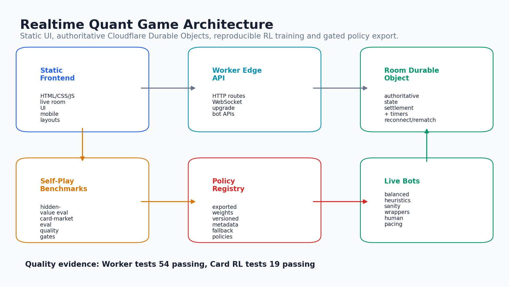
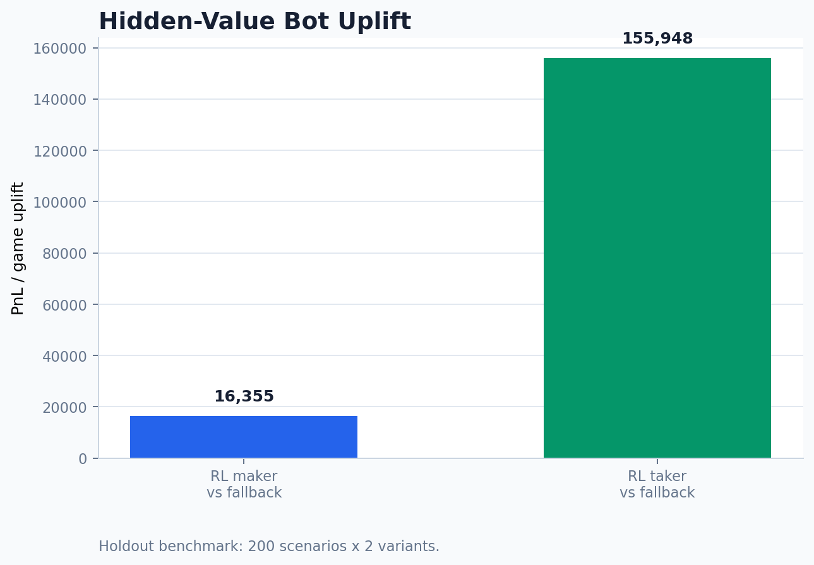
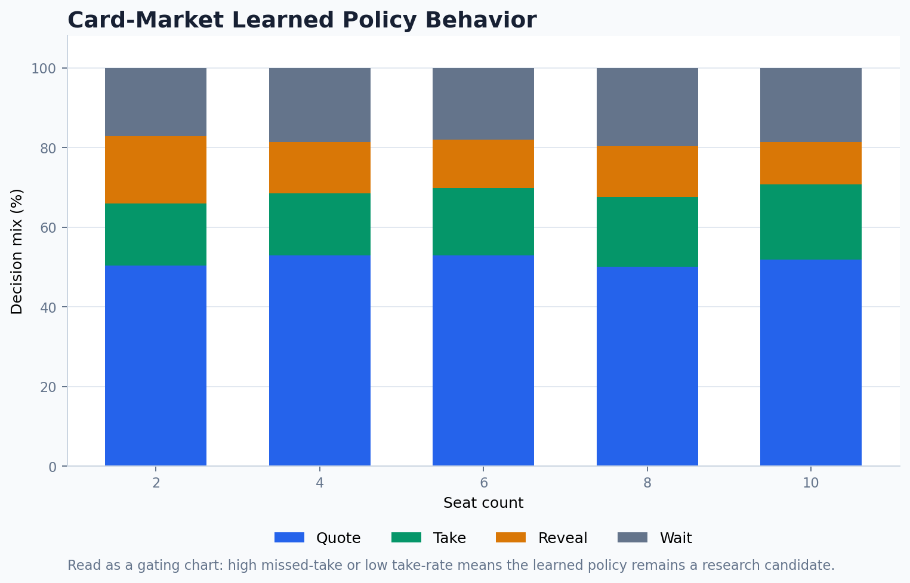
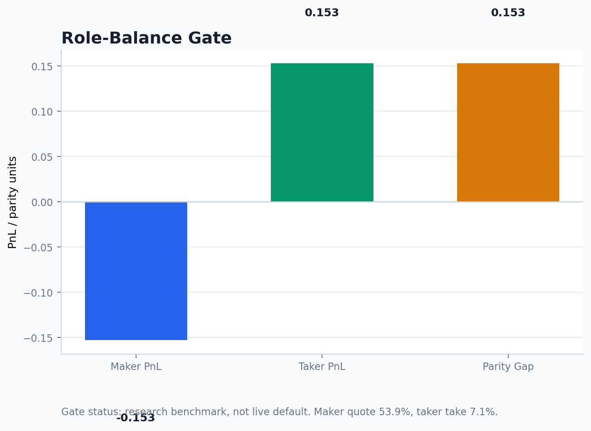
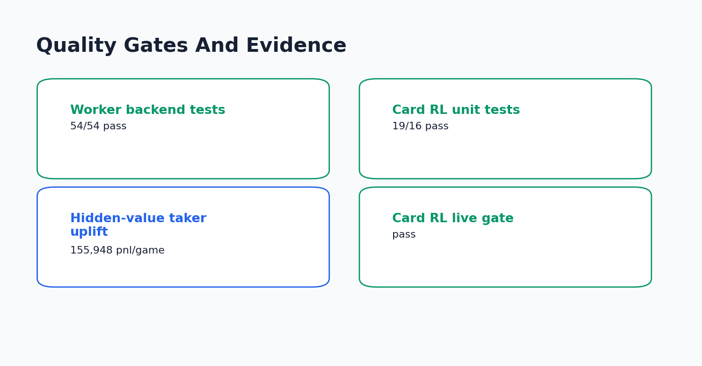
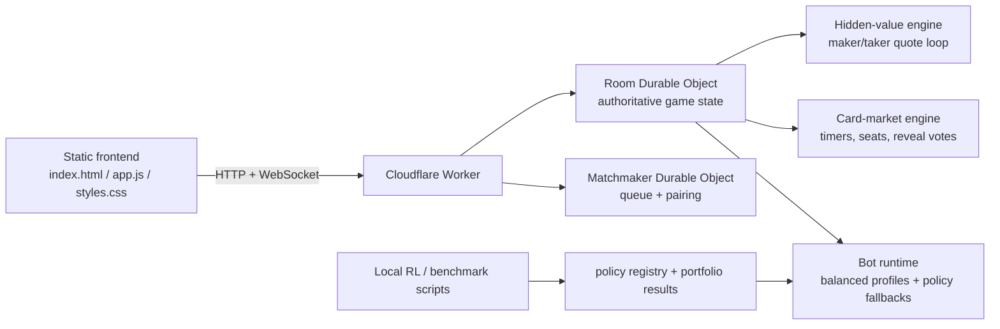

# market-making-sim

A realtime market-making game and RL benchmark platform built to show production software engineering, quant modeling, and ML evaluation in one project.

Live demo: [GitHub Pages](https://aditya1909-bit.github.io/market-making-sim/)  
Live backend: [Cloudflare Worker](https://market-making-sim-backend.adityasdutta.workers.dev)



## Thesis

This project turns market-making interview games into a deployed multiplayer system: players quote and trade hidden-value contracts, card-market tables run with live timers and reveal votes, and bots are evaluated with reproducible holdout benchmarks before they are described as production-ready.

The engineering work is deliberately split the way a real realtime product would be: a static frontend, Cloudflare Workers for routing, Durable Objects for authoritative room state, WebSockets for live play, exported policy registries for bot inference, and reproducible local training/evaluation scripts.

## Results

Generated with:

```bash
python3 scripts/portfolio_benchmark.py --mode quick
python3 scripts/generate_portfolio_graphics.py
```

Current quick benchmark artifacts are committed under `results/portfolio/`. The quick profile uses `200` hidden-value holdout scenarios x `2` variants and `120` card-market episodes per seat count. Full mode is available for longer runs.

| Evidence | Result | Interpretation |
| --- | ---: | --- |
| Worker backend tests | `54/54` passing | Durable Object room flow, bot runtime, card engine, matchmaking, and validation paths are covered. |
| Card RL unit tests | `16/16` passing | Python simulator, features, model helpers, heuristics, and evaluator contracts are covered. |
| Hidden-value RL maker uplift | `+16,354.862` pnl/game | Learned maker improves over fallback maker on holdout. |
| Hidden-value RL taker uplift | `+155,947.676` pnl/game | Learned taker materially reduces the fallback taker's loss profile on holdout. |
| Card RL linear policy vs bootstrap | `+0.822` to `+21.816` pnl by seat count | Learned card policy beats bootstrap across the tested seat counts. |
| Card RL live gate | `research benchmark` | The latest long training pass fixed take starvation but failed maker/taker parity, so the balanced heuristic remains the safer live default. |









## Engineering Depth

- Authoritative multiplayer state with one Cloudflare Durable Object per room.
- Separate Durable Object matchmaking queue with cancellation and same-game ticket reuse logic.
- WebSocket room updates with reconnect handling, stored player ids, host controls, rematches, and role swaps.
- Server-side validation for quote ranges, sizes, active seats, reveal votes, countdowns, stale quotes, and player departures.
- Bot-room APIs that preserve legacy `policyVersion` compatibility while adding human-readable bot profiles.
- Card-market runtime with stochastic bot cooldowns, delayed bot action scheduling, and live fallback policies.
- Frontend states for host, seated player, waiting player, reconnecting player, active round, finished round, and mobile layouts.

## ML And Quant Depth

Hidden-value mode is a compact market-making environment: one maker, one taker, a private settlement value, repeated quotes, fill/pass decisions, and final mark-to-value PnL. The live bot path uses exported policy tables with sanity checks and heuristic fallbacks.

Card Market is a higher-dimensional benchmark: multiple seats, private cards, public hand state, quote/take/reveal/wait actions, inventory, markout, missed-take diagnostics, and role-balance evaluation. The learned `linear-v2` policy is useful evidence of ML iteration, but the benchmark correctly keeps it out of the live-default claim until activity, maker toxicity, and role parity all clear the gate.

The benchmark pipeline saves both raw logs and structured outputs:

```text
results/portfolio/summary.json
results/portfolio/hidden_value_eval.csv
results/portfolio/card_rl_eval.csv
results/portfolio/card_behavior.csv
results/portfolio/role_balance.csv
results/portfolio/raw_logs/
```

## Architecture


```mermaid
flowchart LR
    A["Static frontend<br/>index.html / app.js / styles.css"] -->|HTTP + WebSocket| B["Cloudflare Worker"]
    B --> C["Room Durable Object<br/>authoritative game state"]
    B --> D["Matchmaker Durable Object<br/>queue + pairing"]
    C --> E["Hidden-value engine<br/>maker/taker quote loop"]
    C --> F["Card-market engine<br/>timers, seats, reveal votes"]
    C --> G["Bot runtime<br/>balanced profiles + policy fallbacks"]
    H["Local RL / benchmark scripts"] --> I["policy registry + portfolio results"]
    I --> G
```

## How To Reproduce

Install Worker dependencies:

```bash
cd workers
npm install
```

Run the app locally:

```bash
cd workers
npm run dev
```

In another terminal:

```bash
python3 -m http.server 8000
```

Then open [http://127.0.0.1:8000](http://127.0.0.1:8000). On localhost, the client defaults to `http://127.0.0.1:8787`.

Run the verification suite:

```bash
cd workers && npm test
python3 -m unittest discover card_rl/tests
node rl/evaluate-policy.js --scenarios 1000 --games-per-scenario 2 --split holdout
python3 -m card_rl.evaluate --episodes 3000 --compare-bootstrap
```

Regenerate portfolio artifacts:

```bash
python3 scripts/portfolio_benchmark.py --mode quick
python3 scripts/generate_portfolio_graphics.py
```

Longer benchmark:

```bash
python3 scripts/portfolio_benchmark.py --mode full
python3 scripts/generate_portfolio_graphics.py
```

Full mode defaults to `1000` hidden-value holdout scenarios, `3000` card-market episodes, and up to `11` card RL workers on this machine.

## Repo Layout

```text
index.html, app.js, styles.css
  Static frontend and live room UI.

workers/src/
  Cloudflare Worker entrypoint, Durable Objects, game engines, bot runtimes, protocol types, policy loaders.

rl/
  Hidden-value self-play, evaluation, policy compaction, and KV upload helpers.

card_rl/
  Python simulator, exact posterior features, heuristic teacher, training, export, and evaluation.

scripts/
  Portfolio benchmark runner and graphics generator.

results/portfolio/
  Structured benchmark outputs and raw logs.

docs/assets/
  Generated architecture, benchmark, behavior, and quality-gate graphics.
```

## What I Would Improve Next

- Run a long card-market training sweep and only promote a learned policy after it clears take-rate, missed-take, markout, and parity gates.
- Add browser smoke tests for the live UI across mobile and desktop after each bot or room-state change.
- Add confidence intervals to more card-market comparisons and export a single benchmark HTML report.
- Add replay review for post-game quote quality, fills, role advantage, and bot decision rationale.
